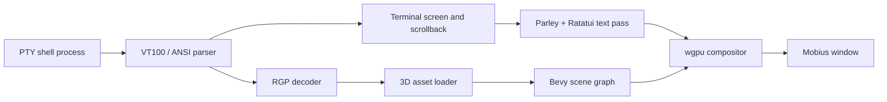

```
███╗   ███╗ ██████╗ ██████╗ ██╗██╗   ██╗███████╗
████╗ ████║██╔═══██╗██╔══██╗██║██║   ██║██╔════╝
██╔████╔██║██║   ██║██████╔╝██║██║   ██║███████╗
██║╚██╔╝██║██║   ██║██╔══██╗██║██║   ██║╚════██║
██║ ╚═╝ ██║╚██████╔╝██████╔╝██║╚██████╔╝███████║
╚═╝     ╚═╝ ╚═════╝ ╚═════╝ ╚═╝ ╚═════╝ ╚══════╝
```

Mobius is a GPU-rendered terminal emulator for experiments with inline 3D
graphics, spatial terminal presentation modes, and terminal-native visual
protocols.

[](LICENSE)
[](https://www.rust-lang.org)
[](https://bevyengine.org)
[](nix/README.md)
[](https://github.com/GiorgiKavtaradze-prog/mobius)

Mobius treats a terminal as more than a 2D grid of glyphs. It keeps the PTY,
VT parser, scrollback, selection, clipboard, and key handling expected from a
terminal emulator, then composites text and 3D objects through Bevy and wgpu.
The result is a terminal surface that can remain flat, tilt into 3D space, fly
through a perspective camera, or wrap onto a Mobius strip.

The inline graphics layer is driven by the Mobius Graphics Protocol (RGP), an
APC escape-sequence protocol that lets terminal applications register, place,
update, and remove 3D assets directly in terminal cell space.

## Contents

- [Highlights](#highlights)
- [Architecture](#architecture)
- [Installation](#installation)
- [Quick Start](#quick-start)
- [Configuration](#configuration)
- [Key Bindings](#key-bindings)
- [Mobius Graphics Protocol](#mobius-graphics-protocol)
- [Ratatui Widget](#ratatui-widget)
- [Nix](#nix)
- [Development](#development)

## Highlights

- GPU compositor built with Bevy 0.19 and wgpu.
- VT100/ANSI terminal parsing through `rio-vt`.
- PTY process management through `portable-pty`.
- Parley/Ratatui text pipeline for terminal grid rendering.
- Inline 3D asset support for OBJ, GLB, and STL files.
- RGP v1 support for path-based and payload-based asset registration.
- Chunked base64 payload support for large assets and remote-shell workflows.
- Placement, update, delete, transform, color, brightness, depth, and animation
  controls for inline objects.
- Flat, orthographic, perspective, and Mobius-strip presentation modes.
- Ten persistent camera presets controlled from the keyboard or RGP.
- Configurable 3D cursor model and cursor animation.
- `ratatui-mobius` widget crate for terminal UI applications.
- Nix flake package, dev shell, NixOS module, and Home Manager module.

## Architecture



Core subsystems:

| Area | Files | Responsibility |
| :--- | :---- | :------------- |
| CLI | `src/cli.rs` | Parses `--config-file`, `--command`, and `--title`. |
| Runtime | `src/runtime.rs`, `src/vt.rs` | Spawns the PTY, reads output, writes input, and drives VT parsing. |
| Terminal | `src/terminal.rs`, `src/rendering.rs` | Stores terminal state and prepares text rendering. |
| RGP | `src/rgp.rs` | Parses Mobius graphics APC sequences. |
| Scene | `src/model.rs`, `src/scene/` | Loads assets and renders 3D presentation modes. |
| Input | `src/keyboard.rs`, `src/mouse.rs` | Handles key bindings, mouse input, copy/paste, and selection. |
| Compositor | `src/plugin.rs`, `src/direct_render.rs` | Integrates Bevy, wgpu, text, and scene rendering. |

## Installation

### Requirements

- Rust stable toolchain with Rust 2024 edition support.
- A GPU and driver supported by wgpu through Vulkan, Metal, DirectX 12, OpenGL,
  or GLES, depending on platform.
- Git for source installs.
- Nix, optional, for reproducible builds and declarative installation.

### From Source

```bash
git clone https://github.com/GiorgiKavtaradze-prog/mobius.git
cd mobius
cargo run --release
```

### Cargo Git Install

```bash
cargo install --git https://github.com/GiorgiKavtaradze-prog/mobius.git
mobius
```

### Nix

```bash
# Run directly
nix run github:GiorgiKavtaradze-prog/mobius

# Install into the current profile
nix profile install github:GiorgiKavtaradze-prog/mobius
```

See [nix/README.md](nix/README.md) for NixOS and Home Manager modules.

## Quick Start

```bash
# Launch Mobius with the default shell resolution
mobius

# Use a custom configuration file
mobius --config-file ~/.config/mobius/mobius.toml

# Set the window title
mobius --title "Mobius"

# Run an explicit command; keep --command / -e at the end
mobius -e zsh
mobius -e bash -lc "htop"
```

Shell selection order:

1. `shell.program` and `shell.args` from configuration.
2. The `SHELL` environment variable.
3. On Windows, Git for Windows `bash.exe` when discoverable.
4. On Windows, `%COMSPEC%`, then `cmd.exe`.
5. On Unix-like systems, `/bin/sh`.

## Configuration

Mobius loads configuration in this order:

1. The explicit `--config-file <path>` argument.
2. The platform user config path for `mobius/mobius.toml` (for example
   `$XDG_CONFIG_HOME/mobius/mobius.toml` or `~/.config/mobius/mobius.toml` on
   Linux).
3. The repository fallback `config/mobius.toml`, when running from source.
4. Built-in defaults.

Relative paths in `cursor.model.path`, `cursor.model.texture`, and
`shell.program` are resolved relative to the selected configuration file when
appropriate.

Minimal example:

```toml
[window]
width = 960
height = 620
opacity = 0.8
update_mode = "Continuous" # "Continuous" or "LowPower"
frame_interval_ms = 33

[terminal]
default_cols = 104
default_rows = 32
scrollback = 2000
mouse_scroll_lines = 3

[shell]
program = "/bin/zsh"
args = []

[env]
TERM = "xterm-256color"

[font]
family = "DejaVu Sans Mono"
style = "Regular" # "Regular", "Bold", "Italic", or "BoldItalic"
size = 12

[cursor.model]
path = "CairoSpinyMouse.obj"
scale_factor = 6.0
brightness = 0.5
x_offset = 0.5
plane_offset = 18.0
color = "#ffffff"
visible = true
# texture = "texture.png"

[cursor.animation]
spin_speed = 1.4
bob_speed = 2.2
bob_amplitude = 0.08

[theme]
foreground = "#dcd7ba"
background = "#1f1f28"
cursor = "#7e9cd8"

[theme.normal]
black = "#000000"
red = "#cd3131"
green = "#0dbc79"
yellow = "#e5e510"
blue = "#2472c8"
magenta = "#bc3fbc"
cyan = "#11a8cd"
white = "#e5e5e5"

[theme.bright]
black = "#666666"
red = "#f14c4c"
green = "#23d18b"
yellow = "#f5f543"
blue = "#3b8eea"
magenta = "#d670d6"
cyan = "#29b8db"
white = "#ffffff"

[bindings]
keys = [
  { key = "Enter", with = "Control | alt", action = "ToggleOrtho3DMode" },
  { key = "P", with = "Control | alt", action = "TogglePersp3DMode" },
  { key = "M", with = "Control | alt", action = "ToggleMobiusMode" },
]
```

Set a binding's `action` to `none` to disable an inherited default binding with
the same trigger.

## Key Bindings

Default bindings:

| Key combination | Action |
| :-------------- | :----- |
| `Ctrl+Alt+Enter` | Toggle orthographic 3D mode. |
| `Ctrl+Alt+P` | Toggle perspective 3D mode. |
| `Ctrl+Alt+M` | Toggle Mobius strip mode. |
| `Ctrl+Alt+Shift+0` through `Ctrl+Alt+Shift+9` | Activate camera preset slots 0-9. |
| `Ctrl+Alt+Up` / `Ctrl+Alt+Down` | Increase or decrease plane warp. |
| `Alt+Up` / `Alt+Down` | Scroll one line. |
| `Alt+PageUp` / `Alt+PageDown` | Scroll one page. |
| `Ctrl+Alt+C` | Copy selected terminal text. |
| `Ctrl+Alt+V` | Paste clipboard contents. |
| `Ctrl+=` / `Ctrl+-` | Increase or decrease font size. |
| `Ctrl+Alt+0` | Reset font size. |

## Presentation Modes

| Mode | Description |
| :--- | :---------- |
| Flat 2D | Standard high-performance terminal rendering. |
| Orthographic 3D | Renders the terminal as a tilted 3D plane with adjustable warp. |
| Perspective 3D | Uses a perspective camera for fly-through terminal-space views. |
| Mobius Strip 3D | Projects the terminal grid onto a continuous Mobius strip surface. |

## Mobius Graphics Protocol

RGP is the terminal-native protocol used to add 3D objects to Mobius. It is
transported through APC escape sequences:

```text
ESC _ mobius;g;<verb>[;<key=value>...] ESC \
```

Supported verbs:

| Verb | Operation |
| :--: | :-------- |
| `s` | Query protocol support. |
| `r` | Register an OBJ, GLB, or STL asset by path or payload. |
| `p` | Place a registered object in terminal cell space. |
| `u` | Update an object's transform or style. |
| `d` | Delete one object or all RGP objects. |
| `c` | Update and optionally activate a camera preset. |

Example:

```bash
# Register an asset by path
printf '\033_mobius;g;r;id=7;fmt=obj;path=CairoSpinyMouse.obj\033\\'

# Place it around row 5, column 10, spanning 4 columns by 3 rows
printf '\033_mobius;g;p;id=7;row=5;col=10;w=4;h=3;animate=1;scale=1.2;depth=1.5;color=7fd0ff;brightness=1.0;ry=45\033\\'

# Rotate it later
printf '\033_mobius;g;u;id=7;ry=180\033\\'

# Switch camera preset 0 to perspective mode
printf '\033_mobius;g;c;id=0;set=1;type=Persp;fov=60;rx=15;ry=25\033\\'

# Delete the object
printf '\033_mobius;g;d;id=7\033\\'
```

For the full wire-format specification, see
[protocols/graphics.md](protocols/graphics.md).

## Ratatui Widget

The `ratatui-mobius` crate lets Ratatui applications emit RGP sequences through
normal widget rendering.

```rust,no_run
use std::io;

use ratatui_core::{buffer::Buffer, layout::Rect, widgets::Widget};
use ratatui_mobius::{MobiusGraphic, MobiusGraphicSettings, ObjectFormat};

fn main() -> io::Result<()> {
    let mut graphic = MobiusGraphic::new(
        MobiusGraphicSettings::new("assets/objects/SpinyMouse.glb")
            .id(42)
            .format(ObjectFormat::Glb)
            .animate(true)
            .scale(1.0)
            .depth(1.5)
            .rotation([0.0, 45.0, 0.0]),
    );

    graphic.register()?;

    let mut buffer = Buffer::empty(Rect::new(0, 0, 80, 24));
    (&graphic).render(Rect::new(10, 5, 20, 8), &mut buffer);

    graphic.settings_mut().rotation = [0.0, 90.0, 0.0];
    graphic.update()?;

    Ok(())
}
```

Widget examples:

- [big_rat.rs](widget/examples/big_rat.rs): minimal inline object demo.
- [document.rs](widget/examples/document.rs): rich document-style demo.
- [draw.rs](widget/examples/draw.rs): 2D drawing pane with live 3D preview.
- [rubiks_cube.rs](widget/examples/rubiks_cube.rs): interactive 3D Rubik's cube.
- [mobius_chess.rs](widget/examples/mobius_chess.rs): 3D Mobius chessboard demo.

See [widget/README.md](widget/README.md) for the widget API guide.

## Nix

Mobius includes:

- `packages.<system>.mobius`
- `devShells.<system>.default`
- `overlays.default`
- `nixosModules.default`
- `homeManagerModules.default`

Typical Nix commands:

```bash
nix develop
nix build
nix flake check
```

Detailed examples are available in [nix/README.md](nix/README.md).

## Development

Main crate checks:

```bash
cargo fmt --all -- --check
cargo clippy --all-targets --all-features -- -D warnings
cargo test --all-targets --all-features
```

Widget crate checks:

```bash
cargo fmt --manifest-path widget/Cargo.toml --all -- --check
cargo clippy --manifest-path widget/Cargo.toml --all-targets -- -D warnings
cargo test --manifest-path widget/Cargo.toml --all-targets
cargo check --manifest-path widget/Cargo.toml --examples
```

Project structure:

```text
mobius/
|-- src/                 # Main terminal emulator crate
|-- protocols/           # RGP specification
|-- widget/              # ratatui-mobius crate
|-- config/              # Default configuration
|-- assets/              # Bundled models and icons
|-- nix/                 # Nix package and module documentation
|-- website/             # Project website
|-- Cargo.toml
`-- flake.nix
```

## Security

Please report vulnerabilities privately. See [SECURITY.md](SECURITY.md) for the
supported version policy and disclosure process.

## License

Mobius is distributed under the [MIT License](LICENSE).

## Acknowledgments

Mobius is inspired by TempleOS-style inline graphical documents, modern
terminal protocol experimentation, Ratatui, Bevy, and the Rust terminal
ecosystem.
