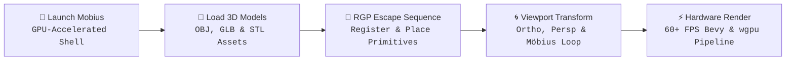
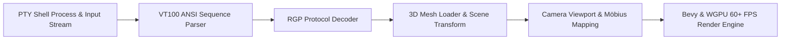

```
███╗   ███╗ ██████╗ ██████╗ ██╗██╗   ██╗███████╗
████╗ ████║██╔═══██╗██╔══██╗██║██║   ██║██╔════╝
██╔████╔██║██║   ██║██████╔╝██║██║   ██║███████╗
██║╚██╔╝██║██║   ██║██╔══██╗██║██║   ██║╚════██║
██║ ╚═╝ ██║╚██████╔╝██████╔╝██║╚██████╔╝███████║
╚═╝     ╚═╝ ╚═════╝ ╚═════╝ ╚═╝ ╚═════╝ ╚══════╝
```

### _A GPU-Rendered Terminal Emulator with Inline 3D Graphics & Non-Euclidean Projections_

**Inspired by TempleOS · Powered by Rust 🦀, Bevy 🎮 & wgpu ⚡**

[](https://crates.io/crates/mobius)
[](LICENSE)
[](https://www.rust-lang.org)
[](https://bevyengine.org)
[](nix/README.md)
[](https://github.com/GiorgiKavtaradze-prog/mobius)

---

[💡 Overview](#-overview) · [🔄 How It Works](#-how-it-works) · [✨ Features](#-features) · [🏗️ Architecture](#️-architecture) · [🚀 Installation](#-installation) · [⚡ Quick Start](#-quick-start) · [⚙️ Configuration](#️-configuration) · [🎮 Key Bindings](#-key-bindings) · [🧊 3D Modes](#-3d-presentation-modes) · [📡 RGP Protocol](#-mobius-graphics-protocol-rgp) · [🧩 Ratatui Widget](#-ratatui-widget) · [❄️ Nix](#-nix-packaging) · [🛠️ Development](#️-development)

---

## 💡 Overview

**Mobius** bridges the gap between classic terminal multiplexing and real-time 3D viewport rendering. Drawing inspiration from **TempleOS**-style inline graphic documents, Mobius treats the command line not just as a 2D grid of glyphs, but as a fully hardware-accelerated 3D canvas.

With native support for **inline 3D mesh rendering** (OBJ, GLB, STL), real-time camera projections, warpable terminal planes, and Möbius strip spatial transforms, Mobius unlocks entirely new paradigms for interactive terminal user interfaces (TUIs), scientific visualization, and game development inside your terminal.

---

## 🔄 How It Works

### Inline 3D & Viewport Execution Flow



---

## ✨ Features

<table>
<tr>
<td width="50%">

### 🖥️ Hardware-Accelerated Rendering

- **Bevy & wgpu Engine Core** for high-throughput GPU rendering
- Sub-pixel text rasterization via **Parley** & **Ratatui**
- Low-power adaptive redraw mode to conserve battery life
- Native window transparency & blur-behind support

</td>
<td width="50%">

### 🧊 Inline 3D Mesh Engine

- Insert 3D models **directly into terminal grid cells**
- Native loading for **OBJ**, **GLB** (animated), and **STL** formats
- Real-time cell-bound transforms (rotation, depth, scale, color)
- **Mobius Graphics Protocol (RGP)** ANSI escape sequence standard

</td>
</tr>
<tr>
<td width="50%">

### 🐁 3D Animated Cursor

- Iconic 3D **Cairo Spiny Mouse** cursor replaces standard block cursors
- Continuous spin & bob animations with custom physics
- Fully customizable mesh, scale, color, and brightness parameters

</td>
<td width="50%">

### 🎥 4 Spatial Presentation Modes

- **Flat 2D** — Ultra-fast classic terminal viewport
- **Orthographic 3D** — Tilt, zoom, and warp terminal planes
- **Perspective 3D** — Fly through terminal buffer space in 3D
- **Möbius Strip 3D** — Wrap terminal buffer onto a continuous Möbius loop

</td>
</tr>
<tr>
<td width="50%">

### 🎮 10 Camera Viewport Presets

- Save, recall, and interpolate across **10 persistent camera slots**
- Instant keybindings for quick scene switching
- Programmable camera transitions over RGP protocol

</td>
<td width="50%">

### 🧩 Ecosystem & Customization

- First-class **`ratatui-mobius`** crate for embedding 3D graphics in TUIs
- Declarative TOML configuration (`mobius.toml`)
- Full **ANSI 16-color palette customization** & font family controls
- First-class **NixOS** and **Home Manager** integration

</td>
</tr>
</table>

---

## 🏗️ Architecture

### Pipeline Execution & Data Flow



### Core Subsystems & Components

- 🐚 **PTY & Runtime Layer ([`src/runtime.rs`](src/runtime.rs), [`src/vt.rs`](src/vt.rs)):**
  Manages background process execution via `portable-pty`. Translates ANSI/VT escape sequences into active screen buffer state using `rio-vt`.
- 📡 **RGP Protocol Engine ([`src/rgp.rs`](src/rgp.rs)):**
  Parses `ESC _ mobius;g;... ESC \` escape sequences in the PTY stream. Handles 3D asset registration (`r`), cell placement (`p`), transforms (`u`), deletion (`d`), and camera commands (`c`).
- 🧊 **3D Scene & Mesh Loader ([`src/model.rs`](src/model.rs), [`src/scene/`](src/scene)):**
  Loads OBJ, GLB, and STL assets asynchronously into Bevy asset pools. Calculates cell-bound transformations, mesh scales, lighting, and non-Euclidean Möbius strip vertex warps.
- 🎥 **Camera Preset Controller ([`src/camera.rs`](src/camera.rs)):**
  Manages 10 persistent camera slots with real-time FOV, rotation, and distance interpolation. Supports orthographic tilting and full 6-DOF perspective navigation.
- ⚡ **Bevy & WGPU Compositor ([`src/plugin.rs`](src/plugin.rs), [`src/direct_render.rs`](src/direct_render.rs)):**
  Combines Parley rasterized text glyphs and 3D mesh geometry into a single hardware-accelerated pass rendered via `wgpu` at 60+ FPS.

---

## 🚀 Installation

### Option 1: Cargo (Rust Package Manager)

```bash
cargo install mobius
```

### Option 2: Build From Source

```bash
# Clone repository
git clone https://github.com/GiorgiKavtaradze-prog/mobius.git
cd mobius

# Build in release mode
cargo build --release

# Run Mobius
./target/release/mobius
```

### Option 3: Nix / Flakes

```bash
# Run directly with Nix
nix run github:GiorgiKavtaradze-prog/mobius

# Install to profile
nix profile install github:GiorgiKavtaradze-prog/mobius
```

> ⚠️ **Requirements:** Mobius requires a GPU with Vulkan, Metal, or DirectX 12 support (via `wgpu`).

---

## ⚡ Quick Start

```bash
# Launch default terminal shell
mobius

# Launch with custom configuration file
mobius --config-file ~/.config/mobius/mobius.toml

# Launch with custom window title
mobius --title "Mobius 3D Terminal"

# Launch directly into a specific shell/command
mobius --command zsh
```

---

## ⚙️ Configuration

Mobius loads settings using the following resolution hierarchy:

1. CLI argument `--config-file <path>`
2. `$XDG_CONFIG_HOME/mobius/mobius.toml`
3. Local default configuration (`config/mobius.toml`)

### Example `mobius.toml`

```toml
[window]
width = 960
height = 620
opacity = 0.85
update_mode = "Continuous" # "Continuous" | "LowPower"
frame_interval_ms = 16

[terminal]
default_cols = 104
default_rows = 32
scrollback = 2000

[font]
family = "JetBrains Mono"
style = "Regular"
size = 14

[theme]
foreground = "#dcd7ba"
background = "#1f1f28"
cursor = "#7e9cd8"
black   = "#090618"
red     = "#c34043"
green   = "#76946a"
yellow  = "#c0a36e"
blue    = "#7e9cd8"
magenta = "#957fb8"
cyan    = "#7aa89f"
white   = "#dcd7ba"

[cursor.model]
path = "CairoSpinyMouse.obj"
scale_factor = 6.0
brightness = 0.5
visible = true

[cursor.animation]
spin_speed = 1.4
bob_speed = 2.2
bob_amplitude = 0.08
```

---

## 🎮 Key Bindings

| Key Combination              | Action                | Description                                  |
| :--------------------------- | :-------------------- | :------------------------------------------- |
| `Ctrl + Alt + Enter`         | **Orthographic Mode** | Toggle tilted orthographic 3D plane view     |
| `Ctrl + Alt + P`             | **Perspective Mode**  | Toggle 3D perspective fly-through camera     |
| `Ctrl + Alt + M`             | **Möbius Strip Mode** | Project terminal grid onto a 3D Möbius loop  |
| `Ctrl + Alt + Shift + [0-9]` | **Camera Presets**    | Save / Activate camera viewpoint slot 0–9    |
| `Ctrl + Alt + ↑ / ↓`         | **Warp Surface**      | Increase / decrease terminal plane curvature |
| `Alt + ↑ / ↓`                | **Scroll Line**       | Scroll viewport up / down by 1 line          |
| `Alt + PageUp / PageDown`    | **Scroll Page**       | Scroll viewport up / down by 1 full page     |
| `Ctrl + Alt + C`             | **Copy**              | Copy selected terminal text buffer           |
| `Ctrl + Alt + V`             | **Paste**             | Paste clipboard content to shell             |
| `Ctrl + = / -`               | **Font Scale**        | Increase / decrease rendered font size       |
| `Ctrl + Alt + 0`             | **Reset Font**        | Reset font size to default                   |

---

- **Flat 2D Mode:** Classic high-performance terminal layout.
- **Orthographic 3D Mode:** Turns your terminal buffer into a tilted, floatable 3D sheet with adjustable plane curvature.
- **Perspective 3D Mode:** Real-time 6-DOF camera control allowing you to fly inside your terminal buffer space.
- **Möbius Strip 3D Mode:** Wraps the entire terminal grid onto a non-orientable Möbius strip, creating a seamless 3D surface loop.

---

## 📡 Mobius Graphics Protocol (RGP)

The **Mobius Graphics Protocol (RGP)** enables any program running inside Mobius to inject, manipulate, and animate 3D assets inline.

### Escape Sequence Syntax

```text
ESC _ mobius;g;<verb>[;<key=value>...] ESC \
```

### Protocol Verbs

| Verb | Operation    | Description                                               |
| :--: | :----------- | :-------------------------------------------------------- |
| `s`  | **Support**  | Query client capabilities & protocol version              |
| `r`  | **Register** | Register a 3D model asset (path or base64 payload)        |
| `p`  | **Place**    | Instantiate model into cell grid space `(row, col, w, h)` |
| `u`  | **Update**   | Modify rotation, depth, scale, brightness, or color       |
| `d`  | **Delete**   | Remove model instance from terminal buffer                |
| `c`  | **Camera**   | Trigger camera preset or alter FOV/angles                 |

### Example Shell Script

```bash
# 1. Register a 3D model asset
printf '\033_mobius;g;r;id=7;fmt=obj;path=CairoSpinyMouse.obj\033\\'

# 2. Place model at row 5, col 10 (spanning 4x3 cells) with animation & lighting
printf '\033_mobius;g;p;id=7;row=5;col=10;w=4;h=3;animate=1;scale=1.2;depth=1.5;color=7fd0ff;brightness=1.0;ry=45\033\\'

# 3. Rotate object dynamically
printf '\033_mobius;g;u;id=7;ry=180\033\\'

# 4. Switch camera to Perspective 3D mode with 60° FOV
printf '\033_mobius;g;c;id=0;set=1;type=Persp;fov=60;rx=15;ry=25\033\\'

# 5. Delete model instance
printf '\033_mobius;g;d;id=7\033\\'
```

📖 **Complete Specification:** [`protocols/graphics.md`](protocols/graphics.md)

---

## 🧩 Ratatui Widget (`ratatui-mobius`)

Mobius provides a native crate for [Ratatui](https://github.com/ratatui/ratatui) applications to render inline 3D assets effortlessly:

```rust
use std::io;
use ratatui_core::{buffer::Buffer, layout::Rect, widgets::Widget};
use ratatui_mobius::{MobiusGraphic, MobiusGraphicSettings, ObjectFormat};

fn main() -> io::Result<()> {
    // Define 3D graphic configuration
    let mut graphic = MobiusGraphic::new(
        MobiusGraphicSettings::new("assets/objects/SpinyMouse.glb")
            .id(42)
            .format(ObjectFormat::Glb)
            .animate(true)
            .scale(1.0)
            .depth(1.5)
            .rotation([0.0, 45.0, 0.0]),
    );

    // Register asset with terminal protocol
    graphic.register()?;

    // Render into Ratatui buffer rect
    let mut buf = Buffer::empty(Rect::new(0, 0, 80, 24));
    (&graphic).render(Rect::new(10, 5, 20, 8), &mut buf);

    // Modify properties in real time
    graphic.settings_mut().rotation = [0.0, 90.0, 0.0];
    graphic.update()?;

    Ok(())
}
```

### Interactive Demos Included

- [`big_rat.rs`](widget/examples/big_rat.rs) — Simple inline 3D model render demo
- [`document.rs`](widget/examples/document.rs) — TempleOS-style rich document editor
- [`draw.rs`](widget/examples/draw.rs) — 2D canvas editor with live 3D object preview
- [`rubiks_cube.rs`](widget/examples/rubiks_cube.rs) — Interactive 3D Rubik's cube TUI game
- [`mobius_chess.rs`](widget/examples/mobius_chess.rs) — 3D Möbius strip chessboard game

---

## ❄️ Nix Packaging

Mobius provides first-class Nix flakes, NixOS, and Home Manager modules:

### NixOS Module Example

```nix
{
  programs.mobius = {
    enable = true;
    gpuBackend = "vulkan"; # "vulkan" | "gl" | "gles"
    settings = {
      window = {
        opacity = 0.9;
        width = 1200;
        height = 800;
      };
      font = {
        family = "JetBrains Mono";
        size = 14;
      };
    };
  };
}
```

📖 **Nix Guide & Flake Documentation:** [`nix/README.md`](nix/README.md)

---

## 📦 Bundled 3D Assets

| Model                 | Format |   Category    | Description                                   |
| :-------------------- | :----: | :-----------: | :-------------------------------------------- |
| `CairoSpinyMouse.obj` | `OBJ`  | Cursor / Mesh | Classic 3D Cairo Spiny Mouse cursor 🐁        |
| `SpinyMouse.glb`      | `GLB`  | Animated Mesh | High-resolution spiny mouse with skeletal rig |
| `Ferris.glb`          | `GLB`  |    Mascot     | Ferris the Rust mascot 🦀                     |
| `SkateMouse.stl`      | `STL`  |     Mesh      | Skateboarding spiny mouse 🛹                  |

---

## 🛠️ Development

```bash
# Build debug binary
cargo build

# Run unit & integration tests
cargo test

# Run code linter
cargo clippy -- -D warnings

# Format codebase
cargo fmt --check
```

### Directory Structure

```text
mobius/
├── src/               # Bevy runtime, render pipeline, VT engine, RGP protocol
│   ├── camera.rs      # Camera projection systems & 10 presets
│   ├── config.rs      # TOML configuration parser
│   ├── keyboard.rs    # Input event map & shortcuts
│   ├── mouse.rs       # Mouse state & text selection
│   ├── rgp.rs         # Mobius Graphics Protocol decoder & dispatcher
│   ├── scene/         # 3D Mesh rendering, planes & Möbius loops
│   └── terminal.rs    # Terminal grid buffer & Parley text engine
├── protocols/         # RGP specification documentation
│   └── graphics.md    # Complete RGP escape sequence standard
├── widget/            # ratatui-mobius widget crate & examples
├── config/            # Default mobius.toml configuration template
├── assets/            # Pre-packaged OBJ, GLB, STL models & icons
├── nix/               # Nix flakes, NixOS & Home Manager modules
└── website/           # Official project website
```

---

## 📄 License

Distributed under the [MIT License](LICENSE).

---

**Crafted with 🧀 & 🦀 by [Giorgi Kavtaradze](https://github.com/GiorgiKavtaradze-prog)**
